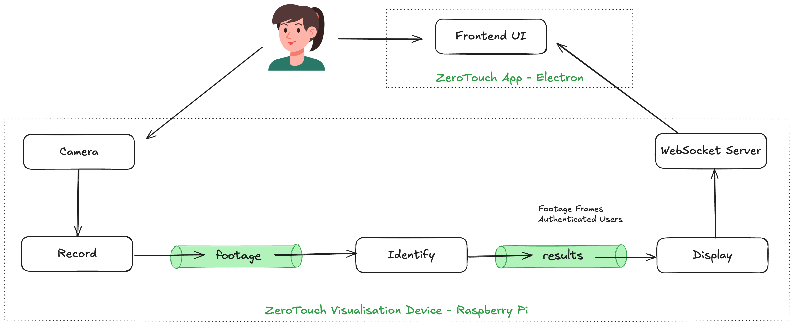

# Zero Touch - Authentication via Facial Recognition

## System Architecture



## Installing and Running

Make sure you have Python3 and Pip3 installed in your Raspberry Pi.

```
$ ./execution.sh
```
